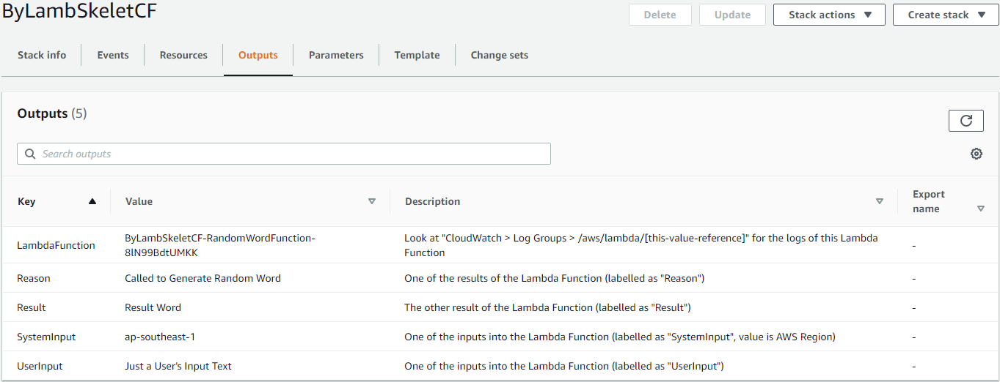
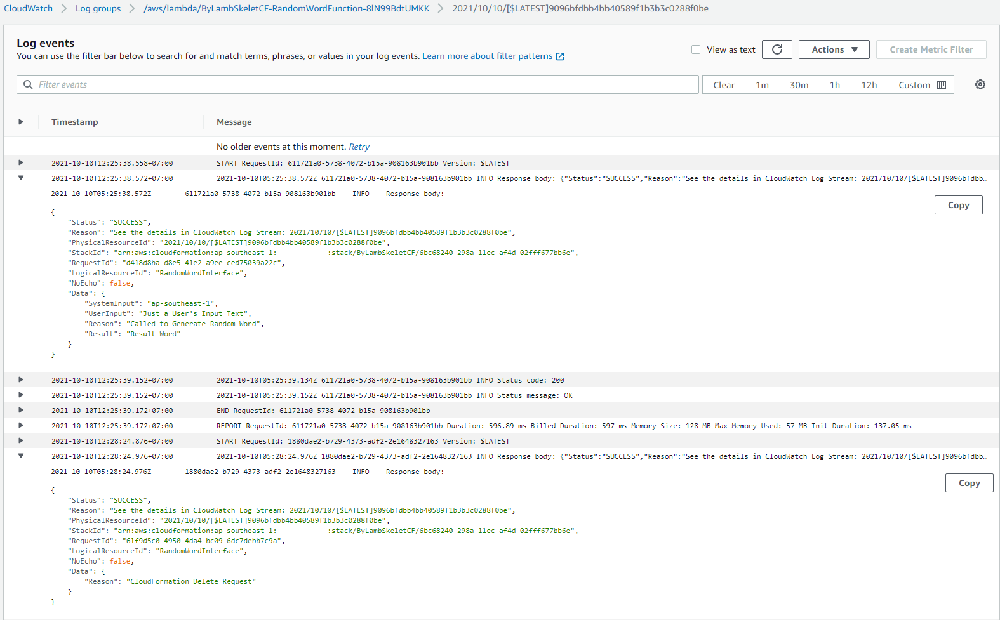
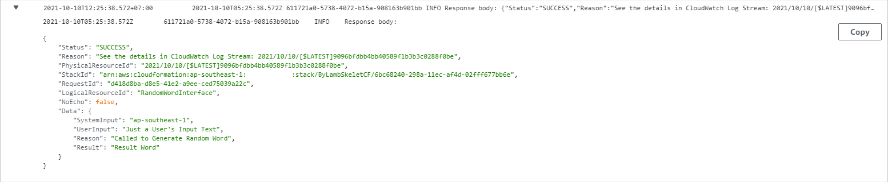
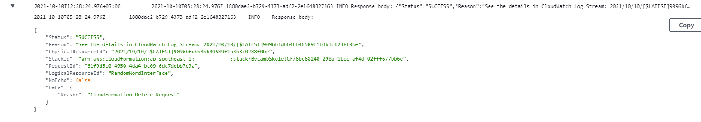

# AWS Lambda within AWS CloudFormation

## InLine

[LambdaSkeletonCF.json](LambdaSkeletonCF.json) contains a sample Lambda skeleton in-line within CloudFormation.

Let's review the components of the CloudFormation and Lambda in [LambdaSkeletonCF.json](LambdaSkeletonCF.json). Basic CloudFormation elements will not be discussed :


### Lambda Execution Role

Minimum Policy Role for the LambdaFunction is to log it's own process to CloudWatch. This may be useful when doing tracing or troubleshooting.

Assuming the Lambda Functions are identical between *In-Line* and *On S3 Bucket*, the Policy Role should be identical also.

```
    "LambdaExecutionRole": {
      "Type": "AWS::IAM::Role",
      "Properties": {
        "AssumeRolePolicyDocument": {
          "Version": "2012-10-17",
          "Statement": [
            {
              "Effect": "Allow",
              "Principal": {
                "Service": [
                  "lambda.amazonaws.com"
                ]
              },
              "Action": [
                "sts:AssumeRole"
              ]
            }
          ]
        },
        "Policies": [
          {
            "PolicyName": "lambdalogtocloudwatch",
            "PolicyDocument": {
              "Version": "2012-10-17",
              "Statement": [
                {
                  "Effect": "Allow",
                  "Action": [
                    "logs:CreateLogGroup",
                    "logs:CreateLogStream",
                    "logs:PutLogEvents"
                  ],
                  "Resource": "arn:aws:logs:*:*:*"
                }
              ]
            }
          }
        ]
      }
    },
```


### Custom Resource

Custom Resource in this specific case is acting as something like the glue or mediator between the CloudFormation and Lambda.

```
    "RandomWordInterface": {
      "Type": "Custom::RandomWordInterface",
      "Properties": {
        "ServiceToken": { "Fn::GetAtt" : ["RandomWordFunction", "Arn"] },
        "SystemInput": { "Ref": "AWS::Region" },
        "UserInput": { "Ref": "UserInput" }
      }
    },
```

Inputs from CloudFormation can be passed to Lambda through the Custom Resource, example from the excerpt above are `"SystemInput": { "Ref": "AWS::Region" },` and `"UserInput": { "Ref": "UserInput" }` .
In the case where no input to the Lambda is needed, the Custom Resource is still needed, example :

```
    "RandomWordInterface": {
      "Type": "Custom::RandomWordInterface",
      "Properties": {
        "ServiceToken": { "Fn::GetAtt" : ["RandomWordFunction", "Arn"] }
      }
    },
```

In some documentations, this Custom Resource also represent what is stated as `Pre Signed S3 URL`, which is useful to pass information / outputs / results from the Lambda Function to CloudFormation.

Assuming the Lambda Functions are identical between *In-Line* and *On S3 Bucket*, the Custom Resource should be identical also.


### Lambda Function (InLine)

```
    "RandomWordFunction": {
      "Type": "AWS::Lambda::Function",
      "Properties": {
        "Code": {
          "ZipFile": {
            "Fn::Join": [
              "\n",
              [
                "var response = require('cfn-response');",
                "exports.handler = function(event, context) {",
                "  var responseData = {};",
                "  if (event.RequestType == 'Delete') {",
                "    //response.send(event, context, response.SUCCESS);",
                "    responseData[\"Reason\"] = \"CloudFormation Delete Request\";",
                "    response.send(event, context, response.SUCCESS, responseData);",
                "    return;",
                "  }",
                "  //var responseStatus = \"SUCCESS\";",
                "  responseData[\"SystemInput\"] = event.ResourceProperties.SystemInput;",
                "  responseData[\"UserInput\"] = event.ResourceProperties.UserInput;",
                "  responseData[\"Reason\"] = \"Called to Generate Random Word\";",
                "  responseData[\"Result\"] = \"Result Word\";",
                "  response.send(event, context, response.SUCCESS, responseData);",
                "};"
              ]
            ]
          }
        },
        "Handler": "index.handler",
        "Runtime": "nodejs14.x",
        "Timeout": "30",
        "Role": {
          "Fn::GetAtt": [
            "LambdaExecutionRole",
            "Arn"
          ]
        }
      }
    }
  },
```

The `Code` section describes how to write in-line Lambda code (example is using NodeJS) into CloudFormation Template.

A few notes here :
- [ ] `"var response = require('cfn-response');",` is needed for logging as well as passing through the results / outputs back to CloudFormation stack. This "import" of `cfn-response` module line is applicable only for in-line Lambda codes. When the Lambda code is located at a S3 bucket, you need to write your own function / module to handle the same. You can copy the source code of the `cfn-response` module from the following GitHub reference. References :
  - [ ] [`cfn-response` module at GitHub](https://github.com/awsdocs/aws-cloudformation-user-guide/blob/main/doc_source/cfn-lambda-function-code-cfnresponsemodule.md) ,
  - [ ] [`cfn-response` module at AWS CloudFormation Documentation](https://docs.aws.amazon.com/AWSCloudFormation/latest/UserGuide/cfn-lambda-function-code-cfnresponsemodule.html) .
- [ ] `"exports.handler = function(event, context) {",` and `"Handler": "index.handler",`. These are the default module name of the in-line Lambda Function, as well as the default handler name of the in-line Lambda Function.
- [ ] Ensure that the `responseData` is initiated (type declaration), as per example : `"var responseData = {};",`. Missing the type declaration will cause any value assignment to the variable to throw error.
- [ ] When CloudFormation is deleted, there will be a call to the Lambda Function, for the Lambda Function to properly close resources / finish its process / terminate resources. This is catched with : `"if (event.RequestType == 'Delete') {",` .
- [ ] You can send response without `responseData`, as example : `"//response.send(event, context, response.SUCCESS);",` .
- [ ] You can use constant `response.SUCCESS` or `response.FAILED` to indicate the success or failure of the Lambda Function;
  - [ ] alternatively you can send string `\"SUCCESS\"` or `\"FAILED\"` instead. Example : `"//var responseStatus = \"SUCCESS\";",` and then followed by `"response.send(event, context, responseStatus, responseData);",` .
- [ ] After a proper initiation of `responseData`, you can assign multiple "Key:Value" properties to `responseData` variable, which you can pick up at the CloudFormation template/stack. Examples :
  - [ ] `"responseData[\"SystemInput\"] = event.ResourceProperties.SystemInput;",` ,
  - [ ] `"responseData[\"UserInput\"] = event.ResourceProperties.UserInput;",` ,
  - [ ] `"responseData[\"Reason\"] = \"Called to Generate Random Word\";",` ,
  - [ ] `"responseData[\"Result\"] = \"Result Word\";",` .


### Obtaining Results / Outputs

```
    "LambdaFunction": {
      "Value": { "Ref": "RandomWordFunction" },
      "Description": "Look at \"CloudWatch > Log Groups > /aws/lambda/[this-value-reference]\" for the logs of this Lambda Function"
    },
    "SystemInput": {
      "Value": { "Fn::GetAtt": [ "RandomWordInterface", "SystemInput" ] },
      "Description": "One of the inputs into the Lambda Function (labelled as \"SystemInput\", value is AWS Region)"
    },
    "UserInput": {
      "Value": { "Fn::GetAtt": [ "RandomWordInterface", "UserInput" ] },
      "Description": "One of the inputs into the Lambda Function (labelled as \"UserInput\")"
    },
    "Reason": {
      "Value": { "Fn::GetAtt": [ "RandomWordInterface", "Reason" ] },
      "Description": "One of the results of the Lambda Function (labelled as \"Reason\")"
    },
    "Result": {
      "Value": { "Fn::GetAtt": [ "RandomWordInterface", "Result" ] },
      "Description": "The other result of the Lambda Function (labelled as \"Result\")"
    }
```

To obtain the results / outputs of the Lambda Function, use `Fn::GetAtt` on the Custom Resource, stating the Key of the `responseData` .

|Data Submitted at Lambda Function|Data Extracted at CloudFormation|
| --- | --- |
|`"responseData[\"SystemInput\"] = event.ResourceProperties.SystemInput;",`|`{ "Fn::GetAtt": [ "RandomWordInterface", "SystemInput" ] }`|
|`"responseData[\"UserInput\"] = event.ResourceProperties.UserInput;",`|`{ "Fn::GetAtt": [ "RandomWordInterface", "UserInput" ] }`|
|`"responseData[\"Reason\"] = \"Called to Generate Random Word\";",`|`{ "Fn::GetAtt": [ "RandomWordInterface", "Reason" ] }`|
|`"responseData[\"Result\"] = \"Result Word\";",`|`{ "Fn::GetAtt": [ "RandomWordInterface", "Result" ] }`|

Assuming the Lambda Functions are identical between *In-Line* and *On S3 Bucket*, the way to extract / obtain Lambda Function's Results should be identical also.


### Visuals

Below are some visuals to help picking up the understanding faster.
We run the example [LambdaSkeletonCF.json](LambdaSkeletonCF.json) on AWS Region `ap-southeast-1`, and give the CloudFormation's Stack Name `ByLambSkeletCF`, and parameter `UserInput` : `Just a User's Input Text` .



| Key | Value | Description | Export name |
| --- | --- | --- | --- |
|LambdaFunction|ByLambSkeletCF-RandomWordFunction-8lN99BdtUMKK|Look at "CloudWatch > Log Groups > /aws/lambda/[this-value-reference]" for the logs of this Lambda Function|-|
|Reason|Called to Generate Random Word|One of the results of the Lambda Function (labelled as "Reason")|-|
|Result|Result Word|The other result of the Lambda Function (labelled as "Result")|-|
|SystemInput|ap-southeast-1|One of the inputs into the Lambda Function (labelled as "SystemInput", value is AWS Region)|-|
|UserInput|Just a User's Input Text|One of the inputs into the Lambda Function (labelled as "UserInput")|-|

Note the value of `LambdaFunction` output, and go to `CloudWatch` > `Log Groups` > `/aws/lambda/ByLambSkeletCF-RandomWordFunction-8lN99BdtUMKK` and click on one of the events on the list.



You can view further in more details by expanding each log item, expecially one with a `Response Body` .
Below is a log containing the response from Lambda Function back to CloudFormation.



```
{
    "Status": "SUCCESS",
    "Reason": "See the details in CloudWatch Log Stream: 2021/10/10/[$LATEST]9096bfdbb4bb40589f1b3b3c0288f0be",
    "PhysicalResourceId": "2021/10/10/[$LATEST]9096bfdbb4bb40589f1b3b3c0288f0be",
    "StackId": "arn:aws:cloudformation:ap-southeast-1:000000000000:stack/ByLambSkeletCF/6bc68240-298a-11ec-af4d-02fff677bb6e",
    "RequestId": "d418d8ba-d8e5-41e2-a9ee-ced75039a22c",
    "LogicalResourceId": "RandomWordInterface",
    "NoEcho": false,
    "Data": {
        "SystemInput": "ap-southeast-1",
        "UserInput": "Just a User's Input Text",
        "Reason": "Called to Generate Random Word",
        "Result": "Result Word"
    }
}
```

You can review the structure of the `responseData` (i.e. the `Data` section of the response).

Below is a log containing the response from Lambda Function back to CloudFormation, when the CloudFormation is Deleted.



```
{
    "Status": "SUCCESS",
    "Reason": "See the details in CloudWatch Log Stream: 2021/10/10/[$LATEST]9096bfdbb4bb40589f1b3b3c0288f0be",
    "PhysicalResourceId": "2021/10/10/[$LATEST]9096bfdbb4bb40589f1b3b3c0288f0be",
    "StackId": "arn:aws:cloudformation:ap-southeast-1:000000000000:stack/ByLambSkeletCF/6bc68240-298a-11ec-af4d-02fff677bb6e",
    "RequestId": "61f9d5c0-4950-4da4-bc09-6dc7debb7c9a",
    "LogicalResourceId": "RandomWordInterface",
    "NoEcho": false,
    "Data": {
        "Reason": "CloudFormation Delete Request"
    }
}
```


***

## External API Call from within Lambda Function (An Example Code)

[RandomWord.json](RandomWord.json) contains an example code identical to the example on [Node.JS CallBack Function](../S3Bucket##nodejs-callback-function) section, with a slight difference that [RandomWord.json](RandomWord.json) has the Lambda Function InLine within the CloudFormation Template.
Kindly refer to [Node.JS CallBack Function](../S3Bucket##nodejs-callback-function) section for more detail explanations on the example.


***

<br><br><br>
```
╔═╦═════════════════╦═╗
╠═╬═════════════════╬═╣
║ ║ End of Document ║ ║
╠═╬═════════════════╬═╣
╚═╩═════════════════╩═╝
```
<br><br><br>


