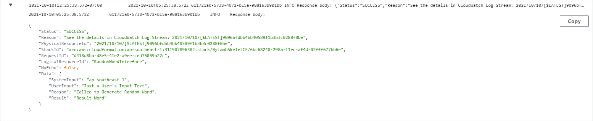
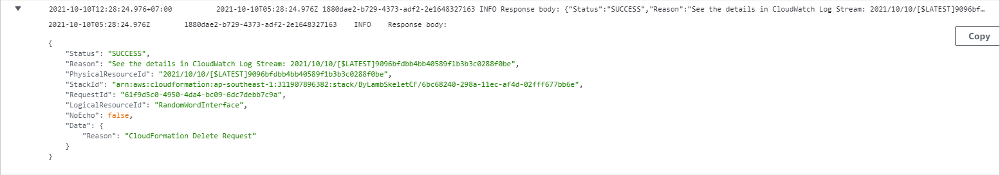

# AWS Lambda within AWS CloudFormation

## InLine

[LambdaSkeletonCF.json](LambdaSkeletonCF.json) contains a sample Lambda skeleton in-line within CloudFormation.

Let's review the components of the CloudFormation and Lambda in [LambdaSkeletonCF.json](LambdaSkeletonCF.json). Basic CloudFormation elements will not be discussed :


### Lambda Execution Role

Minimum Policy Role for the LambdaFunction is to log it's own process to CloudWatch. This may be useful when doing tracing or troubleshooting.

```
    "LambdaExecutionRole": {
      "Type": "AWS::IAM::Role",
      "Properties": {
        "AssumeRolePolicyDocument": {
          "Version": "2012-10-17",
          "Statement": [
            {
              "Effect": "Allow",
              "Principal": {
                "Service": [
                  "lambda.amazonaws.com"
                ]
              },
              "Action": [
                "sts:AssumeRole"
              ]
            }
          ]
        },
        "Policies": [
          {
            "PolicyName": "lambdalogtocloudwatch",
            "PolicyDocument": {
              "Version": "2012-10-17",
              "Statement": [
                {
                  "Effect": "Allow",
                  "Action": [
                    "logs:CreateLogGroup",
                    "logs:CreateLogStream",
                    "logs:PutLogEvents"
                  ],
                  "Resource": "arn:aws:logs:*:*:*"
                }
              ]
            }
          }
        ]
      }
    },
```


### Custom Resource

Custom Resource in this specific case is acting as something like the glue or mediator between the CloudFormation and Lambda.

```
    "RandomWordInterface": {
      "Type": "Custom::RandomWordInterface",
      "Properties": {
        "ServiceToken": { "Fn::GetAtt" : ["RandomWordFunction", "Arn"] },
        "SystemInput": { "Ref": "AWS::Region" },
        "UserInput": { "Ref": "UserInput" }
      }
    },
```

Inputs from CloudFormation can be passed to Lambda through the Custom Resource, example from the excerpt above are `"SystemInput": { "Ref": "AWS::Region" },` and `"UserInput": { "Ref": "UserInput" }` .
In the case where no input to the Lambda is needed, the Custom Resource is still needed, example :

```
    "RandomWordInterface": {
      "Type": "Custom::RandomWordInterface",
      "Properties": {
        "ServiceToken": { "Fn::GetAtt" : ["RandomWordFunction", "Arn"] }
      }
    },
```

In some documentations, this Custom Resource also represent what is stated as `Pre Signed S3 URL`, which is useful to pass information / outputs / results from the Lambda Function to CloudFormation.


### Lambda Function (InLine)

```
    "RandomWordFunction": {
      "Type": "AWS::Lambda::Function",
      "Properties": {
        "Code": {
          "ZipFile": {
            "Fn::Join": [
              "\n",
              [
                "var response = require('cfn-response');",
                "exports.handler = function(event, context) {",
                "  var responseData = {};",
                "  if (event.RequestType == 'Delete') {",
                "    //response.send(event, context, response.SUCCESS);",
                "    responseData[\"Reason\"] = \"CloudFormation Delete Request\";",
                "    response.send(event, context, response.SUCCESS, responseData);",
                "    return;",
                "  }",
                "  //var responseStatus = \"SUCCESS\";",
                "  responseData[\"SystemInput\"] = event.ResourceProperties.SystemInput;",
                "  responseData[\"UserInput\"] = event.ResourceProperties.UserInput;",
                "  responseData[\"Reason\"] = \"Called to Generate Random Word\";",
                "  responseData[\"Result\"] = \"Result Word\";",
                "  response.send(event, context, response.SUCCESS, responseData);",
                "};"
              ]
            ]
          }
        },
        "Handler": "index.handler",
        "Runtime": "nodejs14.x",
        "Timeout": "30",
        "Role": {
          "Fn::GetAtt": [
            "LambdaExecutionRole",
            "Arn"
          ]
        }
      }
    }
  },
```

The `Code` section describes how to write in-line Lambda code (example is using NodeJS) into CloudFormation Template.

A few notes here :
- [ ] `"var response = require('cfn-response');",` is needed for logging as well as passing through the results / outputs back to CloudFormation stack. This "import" of `cfn-response` module line is applicable only for in-line Lambda codes. When the Lambda code is located at a S3 bucket, you need to write your own function / module to handle the same. You can copy the source code of the `cfn-response` module from the following GitHub reference. References : [`cfn-response` module at GitHub](https://github.com/awsdocs/aws-cloudformation-user-guide/blob/main/doc_source/cfn-lambda-function-code-cfnresponsemodule.md) , [`cfn-response` module at AWS CloudFormation Documentation](https://docs.aws.amazon.com/AWSCloudFormation/latest/UserGuide/cfn-lambda-function-code-cfnresponsemodule.html) .
- [ ] `"exports.handler = function(event, context) {",` and `"Handler": "index.handler",`. These are the default module name of the in-line Lambda Function, as well as the default handler name of the in-line Lambda Function.
- [ ] Ensure that the `responseData` is initiated (type declaration), as per example : `"var responseData = {};",`. Missing the type declaration will cause any value assignment to the variable to throw error.
- [ ] When CloudFormation is deleted, there will be a call to the Lambda Function, for the Lambda Function to properly close resources / finish its process / terminate resources. This is catched with : `"if (event.RequestType == 'Delete') {",` .
- [ ] You can send response without `responseData`, as example : `"//response.send(event, context, response.SUCCESS);",` .
- [ ] After a proper initiation of `responseData`, you can assign multiple "Key:Value" properties to `responseData` variable, which you can pick up at the CloudFormation template/stack. Examples : `"responseData[\"SystemInput\"] = event.ResourceProperties.SystemInput;",`, `"responseData[\"UserInput\"] = event.ResourceProperties.UserInput;",`, `"responseData[\"Reason\"] = \"Called to Generate Random Word\";",`, `"responseData[\"Result\"] = \"Result Word\";",` .


`ByLambSkeletCF`


| Key | Value | Description | Export name |
| --- | --- | --- | --- |
|LambdaFunction|ByLambSkeletCF-RandomWordFunction-8lN99BdtUMKK|Look at "CloudWatch > Log Groups > /aws/lambda/[this-value-reference]" for the logs of this Lambda Function|-|
|Reason|Called to Generate Random Word|One of the results of the Lambda Function (labelled as "Reason")|-|
|Result|Result Word|The other result of the Lambda Function (labelled as "Result")|-|
|SystemInput|ap-southeast-1|One of the inputs into the Lambda Function (labelled as "SystemInput", value is AWS Region)|-|
|UserInput|Just a User's Input Text|One of the inputs into the Lambda Function (labelled as "UserInput")|-|




```
{
    "Status": "SUCCESS",
    "Reason": "See the details in CloudWatch Log Stream: 2021/10/10/[$LATEST]9096bfdbb4bb40589f1b3b3c0288f0be",
    "PhysicalResourceId": "2021/10/10/[$LATEST]9096bfdbb4bb40589f1b3b3c0288f0be",
    "StackId": "arn:aws:cloudformation:ap-southeast-1:311907896382:stack/ByLambSkeletCF/6bc68240-298a-11ec-af4d-02fff677bb6e",
    "RequestId": "d418d8ba-d8e5-41e2-a9ee-ced75039a22c",
    "LogicalResourceId": "RandomWordInterface",
    "NoEcho": false,
    "Data": {
        "SystemInput": "ap-southeast-1",
        "UserInput": "Just a User's Input Text",
        "Reason": "Called to Generate Random Word",
        "Result": "Result Word"
    }
}
```




```
{
    "Status": "SUCCESS",
    "Reason": "See the details in CloudWatch Log Stream: 2021/10/10/[$LATEST]9096bfdbb4bb40589f1b3b3c0288f0be",
    "PhysicalResourceId": "2021/10/10/[$LATEST]9096bfdbb4bb40589f1b3b3c0288f0be",
    "StackId": "arn:aws:cloudformation:ap-southeast-1:311907896382:stack/ByLambSkeletCF/6bc68240-298a-11ec-af4d-02fff677bb6e",
    "RequestId": "61f9d5c0-4950-4da4-bc09-6dc7debb7c9a",
    "LogicalResourceId": "RandomWordInterface",
    "NoEcho": false,
    "Data": {
        "Reason": "CloudFormation Delete Request"
    }
}
```


***

<br><br><br>
```
╔═╦═════════════════╦═╗
╠═╬═════════════════╬═╣
║ ║ End of Document ║ ║
╠═╬═════════════════╬═╣
╚═╩═════════════════╩═╝
```
<br><br><br>


